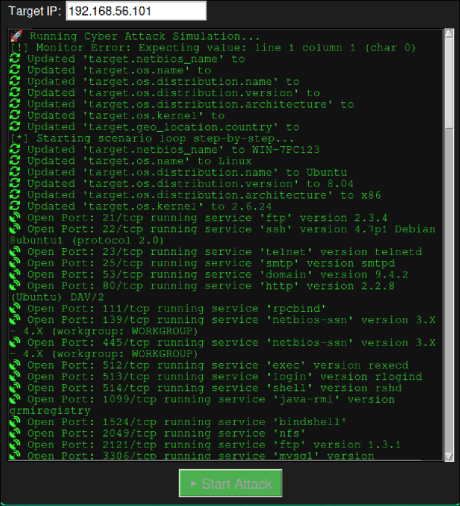
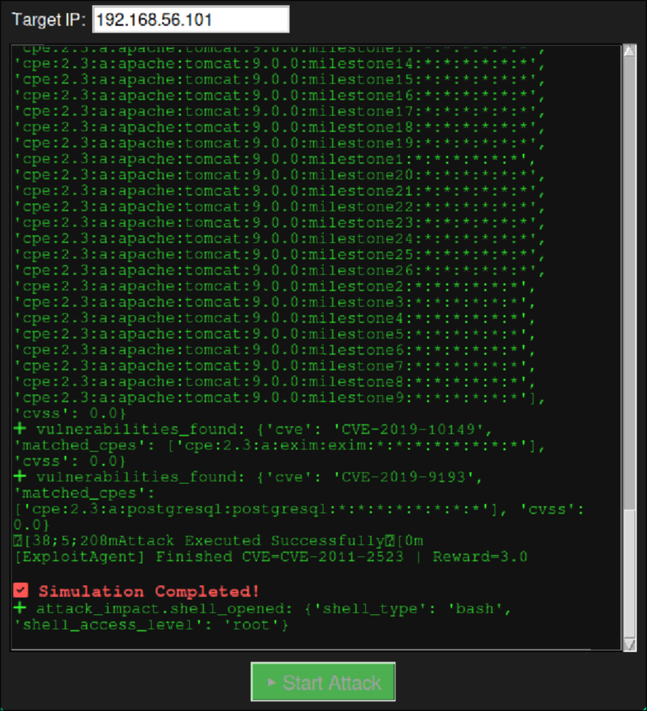

# ⚔️ Cyber-AI Offensive Framework  

Welcome to a fully autonomous offensive AI system for cyber attacks, driven by reinforcement learning and language models.  

---

## 🔧 SETUP INSTRUCTIONS (ARCH LINUX)

### 📌 Requirements:
- 🐍 Python 3.9+
- 🧱 C++17 compiler (e.g., `g++`)
- ❗ Disk space: ~6GB minimum, 10GB+ recommended
- 🧠 RAM: 8GB minimum, 16GB+ recommended for larger context

---

## 🚀 STEP 1: Install All Dependencies

### 👉 Arch Linux:
```bash
sudo pacman -Syu --needed python python-pip git base-devel cmake nmap metasploit wget curl unzip gcc make
sudo pacman -S virtualbox docker docker-compose  metasploit
pip install pexpect huggingface_hub torch numpy requests beautifulsoup4 pandas
yay -S zenmap armitage
```

### (Optional) Login to HuggingFace if the model is gated:
```bash
huggingface-cli login  # ← paste your token
```

---

## 💾 STEP 2: Download the Model (GGUF Format)

> Download Nous-Hermes-2-Mistral-7B-DPO in quantized `.gguf` format (Q4_K_M recommended):

```bash
wget -P {your_project_directory}/code/models/nous-hermes/ \
https://huggingface.co/NousResearch/Nous-Hermes-2-Mistral-7B-DPO-GGUF/resolve/main/Nous-Hermes-2-Mistral-7B-DPO.Q4_K_M.gguf
```

---

## 🛠️ STEP 3: Clone & Build llama.cpp

```bash
cd {your_project_directory}/code/models/
git clone https://github.com/ggerganov/llama.cpp.git
cd llama.cpp
mkdir build
cd build
cmake ..
cmake --build . --config Release -j$(nproc)
```

---

## 🧠 STEP 5: Run the Full Autonomous Framework

Once the model and dependencies are ready, launch the full AI system:

```bash
python main.py
```

The agent will:
- Initialize datasets (CVE, Exploits, OS, etc.)
- Encode the environment state
- Use the LLM to reason about reconnaissance and attacks
- Select and execute actions using reinforcement learning

---

## 📂 Directory Structure

```text
project/
├── code/
│   ├── agents/               # Recon, Vuln, Exploit agents
│   ├── blackboard/           # Shared knowledge base
│   ├── encoders/             # State/Action encoders
│   ├── models/               # Policy model, LLM wrapper
│   ├── orchestrator/         # Scenario manager
│   └── utils/                # Helpers and tools
├── datasets/                 # CVE, exploit, OS datasets
├── models/                   # Saved LLM and policy model
└── main.py                   # Entry point
```

---

## 🧠 What Does This Framework Do?

This is a **fully autonomous offensive AI system** that performs reconnaissance, vulnerability analysis, and exploitation — all without human input.

The system operates in discrete decision steps using **Reinforcement Learning (DQN)**, **LLMs** for reasoning, and a shared state representation for coordination.

---

## 🧩 Key Components

### 🕵️ Reconnaissance Agent (`agents/recon_agent.py`)
- Selects the next command using DQN policy based on the current state
- Executes network and system-level recon commands (e.g., `nmap`, `whois`, `curl`, `gobuster`)
- Uses an LLM to interpret and extract structured information from unstructured command output
- Updates the shared JSON state

---

### 💣 Exploit Agent (`agents/exploit_agent.py`)
- Generates CPEs and maps them to top CVEs (via NVD)
- Uses DQN to choose from 2,500+ Metasploit exploits
- Executes exploits and parses results
- Calculates reward based on exploit success/failure and feeds it back to the model

---

### 📚 Shared Knowledge (Blackboard Pattern) (`blackboard/`)
- Maintains a global, continuously updated JSON state
- Used by all agents to synchronize and reason
- Encodes: discovered services, ports, OS, vulnerabilities, and actions history

---

### 📦 Encoders (`encoders/`)
- Transforms raw system/agent outputs into structured state vectors for RL
- Converts chosen actions into executable system commands

---

### 🧠 LLM Wrapper (`models/llm_wrapper.py`)
- Runs an instruction-following LLM (e.g., Nous-Hermes) using `llama.cpp`
- Parses recon output (HTML, terminal, JSON) and extracts entities like services, versions, CVEs, etc.

---

### 🧪 Orchestrator (`orchestrator/`)
- Coordinates training episodes or attack scenarios
- Resets environment state, switches targets, logs metrics

---

### 🧰 Utils (`utils/`)
- Logging, metrics, graphing tools
- Parsing helpers and formatters

---

## 🔁 Reinforcement Learning Loop

At each step:

1. Recon Agent observes state and chooses recon command  
2. LLM parses output → shared state is updated  
3. Exploit Agent evaluates updated state and chooses exploit  
4. Reward is computed → both agents' policies are updated  
5. Loop continues until goal is achieved or time expires

---

## 📸 Live Execution Snapshots

Below are two screenshots demonstrating real-time execution of the AI offensive agent:

<p align="center">
  
</p>

<p align="center">
  
</p>

Each frame captures a different phase:
- 🕵️‍♂️ Recon Agent performing service enumeration and parsing output with the LLM
- 💥 Exploit Agent launching a Metasploit module and receiving shell access

---

## 🎯 Project Goals

- Demonstrate an autonomous AI agent capable of offensive cyber operations
- Combine symbolic reasoning (LLMs) with decision-making (RL)
- Enable interpretable, adaptive, and scalable attack workflows
